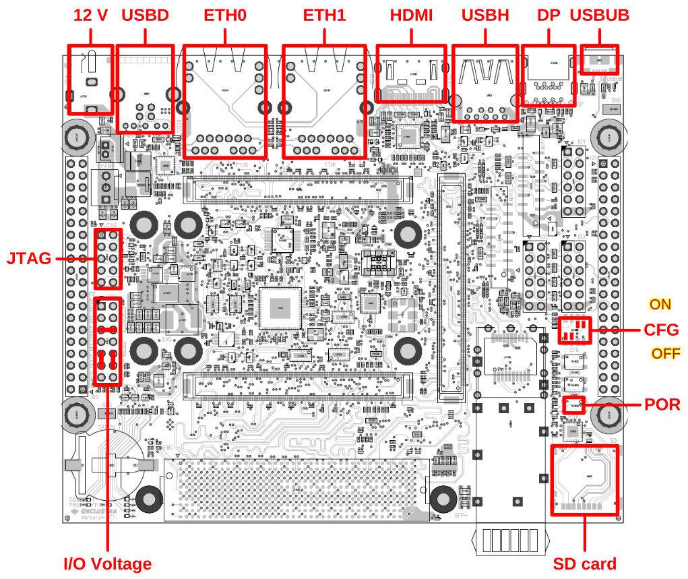

Meta-user-aa1
=============

This repository contains a Yocto layer to generate the Linux reference design
for the following Enclustra SoC module family:

- Enclustra Mercury+ AA1 product series: https://www.enclustra.com/en/products/system-on-chip-modules/mercury-aa1/

The reference design is compatible with following base board:

- Enclustra Mercury+ ST1: https://www.enclustra.com/en/products/base-boards/mercury-st1

The HW reference design files for Mercury+ AA1 ST1 module and baseboard live here:

- Mercury+ AA1 ST1 Reference Design: https://github.com/enclustra/Mercury_AA1_ST1_Reference_Design

Dependencies
============

This layer depends on meta-intel-fpga and OE core:

* URI: https://git.yoctoproject.org/meta-intel-fpga
* branch: mickledore
* layer: meta-intel-fpga

* URI: https://git.openembedded.org/openembedded-core
* branch: mickledore
* layer: meta

* URI: http://git.openembedded.org/meta-openembedded
* branch: mickledore
* layer: meta-oe

This layer also still depends on the meta-enclustra-socfpga module layer for user
machine compatibility, eg, the initial ``me-aa1-270-2i2-d11e-nfx3`` machine and
related recipes:

* URI: https://github.com/enclustra/meta-enclustra-socfpga
* branch: v2023.1
* layer: meta-enclustra-module

The primary indirect dependency is Quartus XX Std/Pro, where XX and type
depends on the SoC and u-boot version. Other versions may work with a given
project, but vendor support will most likely expect their published reqs,
eg, the versions mentioned here require the following:

=======================  ==============   =================   =================
Processor                SOCFPGA Device   Intel Quartus Pro   Intel Quartus Std
-----------------------  --------------   -----------------   -----------------
Dual-core ARM Cortex-A9   Cyclone V        N/A                 22.1
|                         Arria 10         23.1                N/A
=======================  ==============   =================   =================

All arm64 devices require Intel Quartus Pro.

Custom machine overrides
========================

Upstream "doc" bits:

* `bitbake manual section`_
* `glossary section`_
* `machine groups on SO`_

References on this topic seem pretty thin, so now we include some example machine
overrides that allow the following:

* use generic "platform" overrides to separate debug and hardened images for
  the same hardware
* migrate from the enclustra "starter" machines to custom devel and production
  boards

.. _bitbake manual section: https://docs.yoctoproject.org/bitbake/2.10/bitbake-user-manual/bitbake-user-manual-metadata.html#conditional-syntax-overrides
.. _glossary section: https://docs.yoctoproject.org/ref-manual/variables.html#term-MACHINEOVERRIDES
.. _machine groups on SO: https://stackoverflow.com/questions/77667680/how-to-create-groups-of-machines-for-use-in-machine-specific-overrides

The meta-enclustra-module layer should above provides user "starter" machine
defs for each supported combination of base board and module, eg, the initial
default machine definitions for the Mercury+ AA1 module on ST1 base board:

* me-aa1-270-2i2-d11e-nfx3_

This layer now includes additional (mostly abstract) machine definitions based
on the above baseboard/module combination.

Production/development pipeline machines:

:debug-baseboard: Baseline debug/devel machine compatible with enclustra AA1/ST1
:hardened-baseboard: Baseline hardened/production machine compatible with enclustra AA1/ST1

Platform classification overrides:

:debug-platform: Use to add/set devel feature overrides and SRC_URI appends
:hardened-platform: Use to remove debug features and/or set hardening options
:st1-baseboard: Generic machine override compatible with enclustra AA1/ST1

.. _me-aa1-270-2i2-d11e-nfx3: https://github.com/enclustra/meta-enclustra-socfpga/blob/v2023.1/meta-enclustra-module/conf/machine/me-aa1-270-2i2-d11e-nfx3.conf

Example machine overrides
--------------------------

Use the platform overrides to configure a production image recipe::

  # read-only root filesystem
  IMAGE_FEATURES:append:hardened-platform = " read-only-rootfs stateless-rootfs"
  IMAGE_FEATURES:remove:hardened-platform = " debug-tweaks package-management ssh-server-openssh"

Use a production machine override to include devicetree files for a custom board::

  FILESEXTRAPATHS:prepend:production-board := "${THISDIR}/production-board:"

  COMPATIBLE_MACHINE += "|me-st1-generic|st1-baseboard"

  SRC_URI:append:production-board = " file://stech-board.dtsi"

The "pipeline" machines described above should *replace* current the default user
machine above, however, the simple machines defined here still depend on both
machine defs and recipe overrides defined by enclustra (in their module layer).

Custom overrides for specific machine features or other build settings should be
added as-needed, starting with the the example common machine include file::

  $ cat conf/machine/include/aa1-st1-common.conf 
  # Common machine support for enclustra aa1 module and st1 carrier board
  #

  MACHINEOVERRIDES:prepend = "me-aa1-270-2i2-d11e-nfx3:me-st1-generic:"

  require conf/machine/me-aa1-generic.conf

  IMAGE_FSTYPES:append = " wic ext4"

The above built image artifacts are appended to the defaults set in the enclustra
module layer: ``IMAGE_FSTYPES = "cpio.gz.u-boot wic.bmap tar.gz"`` (in this case
the assignment is *not* weak).

The upstream BSP layers in both meta-enclustra-socfpga_ and meta-intel-fpga_ should
be used as the "documented" upstream machine definitions.

.. _meta-enclustra-socfpga: https://github.com/enclustra/meta-enclustra-socfpga
.. _meta-intel-fpga: https://git.yoctoproject.org/meta-intel-fpga

Custom exported binaries
========================

Each enclustra (socfpga) reference design gets a Yocto machine definition,
however, user projects should select one of the base machines provided by
the enclustra module layer => meta-enclustra-module_ (one of the layers
provided in meta-enclustra-socfpga_) to get started. Given the current AA1/ST1
hardware, the correct (yocto) user machine is ``me-aa1-270-2i2-d11e-nfx3``.

The user project must provide a zipfile containing the build files from the
desired Quartus project, ie, 1) the bitstream ``.sof`` must be converted to
the split ``.rbf`` files expected by Arria10 devices, and 2) the handoff
directory must contain the ``hps.xml`` project definitions. Each of the
reference design projects contains three file trees, one for each boot
mode, and the corresponding user built projects should mimic this layout
by providing *at least one* of these file trees.

For example, a user project using the QSPI boot mode would use the following
layout::

  $ tree -l 3 qspi/
  qspi/                         # directory name matches boot mode: qspi, emmc, sdmmc
  ├── bitstream.core.rbf        # split bitsream required for Arria10
  ├── bitstream.periph.rbf      # second part
  ├── hps_isw_handoff           # required handoff directory
  │   ├── emif.xml
  │   ├── hps.xml
  │   └── id
  ├── Mercury_AA1_pd.sopcinfo   # additional files are okay
  └── Mercury_AA1_ST1.sof

  2 directories, 7 files

To produce the "source" zipfile for the exported_binaries recipe, zip the
above directory tree using the machine name in upper case prepended with
the bootmode in lower case::

  $ zip -r qspi_ME-AA1-270-2I2-D11E-NFX3.zip qspi/

.. _meta-enclustra-module: https://github.com/enclustra/meta-enclustra-socfpga/tree/v2023.1/meta-enclustra-module
.. _meta-enclustra-socfpga: https://github.com/enclustra/meta-enclustra-socfpga

Adding this layer to your build
===============================

In order to use this layer, you need to make the build system aware of it.

Assuming the layer exists at the top-level of your build tree, you can add
it to the build system by adding the location of this layer to
bblayers.conf, along with any other layers needed. e.g.::

  BBLAYERS ?= " \
    /path/to/oe-core/meta \
    /path/to/meta-openembedded/meta-oe \
    /path/to/layer/meta-user-aa1 "

Arria10 yocto and handoff references
====================================

Note that handoff process and tooling has changed several times in recent
versions of quartus and u-boot-socfpga. The handoff names are different for
different SoCs but this is primarily about Arria10 only.  User configuration
bits have mainly been moved to u-boot and the linux kernel configs. Each
vendor has slightly different usage depending on specific hardware, where
enclustra requires specific filenames for the user DTS files and combines
the split FPGA bitstream files via FIT image.

* meta-enclustra_
* `enclustra user layer`_
* enclustra-refdes_ - see reference design document link

* `Intel handoff bug`_
* `rocketboards bootloader doc`_ - Arria 10, u-boot-socfpga 2024.01, linux-socfpga 6.6.22-lts, Quartus 24.2 Pro

* `U-boot-socfpga`_ - bootloader and handoff tools
* `doc/README.socfpga`_ - device-specific readme

* `Split .sof files`_ - create split bitstream files for Yocto (`also mentioned here`_)
* HWLib_ - low-level SW interface to system HW

.. _meta-enclustra: https://github.com/enclustra/meta-enclustra-socfpga/blob/v2023.1/README.md
.. _enclustra user layer: https://github.com/enclustra/meta-enclustra-socfpga/tree/v2023.1?tab=readme-ov-file#integrate-meta-enclustra-module-layer-into-user-project
.. _enclustra-refdes: https://github.com/enclustra/Mercury_AA1_ST1_Reference_Design
.. _Intel handoff bug: https://www.intel.com/content/www/us/en/support/programmable/articles/000090551.html
.. _rocketboards bootloader doc: https://www.rocketboards.org/foswiki/Documentation/BuildingBootloaderCycloneVAndArria10
.. _U-boot-socfpga: https://github.com/altera-opensource/u-boot-socfpga
.. _doc/README.socfpga: https://github.com/altera-opensource/u-boot-socfpga/blob/HEAD/doc/README.socfpga
.. _Split .sof files: https://www.rocketboards.org/foswiki/Documentation/A10SGMIIRDCompilingHardwareDesignLTS
.. _also mentioned here: https://www.intel.com/content/www/us/en/docs/programmable/683536/current/converting-the-sof-file-into-two-split.html
.. _HWLib: https://www.rocketboards.org/foswiki/Documentation/HWLib

Minimal user layer
==================

For Arria10 the inputs are the following:

* ``hps.xml`` - system definition from quartus project
* ``<prj_name>.sof`` - FPGA bitstream from quartus project
* ``enclustra-user.dts`` - user-defined kernel and u-boot devicetree files
* user-defined kernel and u-boot configs
* uses machine definition from the module layer

Prepare inputs for u-boot
-------------------------

The first input is converted to a u-boot header file using a script from
the u-boot source, whereas the second file must be converted to the ``.rbf``
bitstream format. For Arria10 the latter is split into 2 files for core
and peripheral setup.

To achieve the latter, run the quartus command shell and then something like
the following to generate both ``.rbf`` files::

  $ quartus_cpf -c --hps -o bitstream_compression=on output_files/<prj_name>.sof output_files/<prj_name>.rbf

The above should create two files named ``<prj_name>.core.rbf`` and ``<prj_name>.periph.rbf``

Boot mode switches
------------------

Note this is condensed from the reference design doc:

The boot mode switches are shown in the above image as CFG (where only
the first 2 affect boot mode directly). Confirm the ON direction on your
board; use a magnifier if necessary. The following boot mode options are
extracted from the reference design documant link.

:sdmmc: CFG = [1: OFF, 2: OFF, 3: ON, 4: ON]  (factory default)
:emmc: CFG = [1: ON, 2: ON, 3: ON, 4: ON]
:qspi: CFG = [1: ON, 2: OFF, 3: ON, 4: ON]

Also note boot mode is used as a configuration variable for both the HW design
build *and* the bootloader images, thus the project must be (re)built for each
boot mode in order to generate the full zipfile for the "exported_binaries"
Yocto recipe.

License
=======

All metadata is MIT licensed unless otherwise stated. Source code included
in tree for individual recipes is under the LICENSE stated in each recipe
(.bb file) unless otherwise stated.
